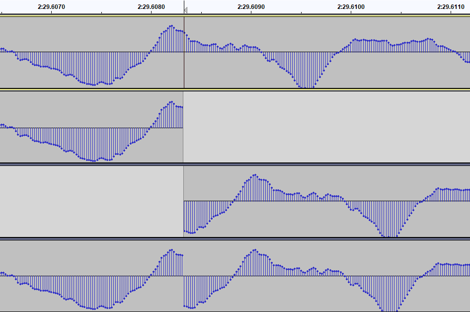

# mlp

A Dolby TrueHD demuxer and utility tool, with a focus on accurately and correctly demuxing a TrueHD stream from a decrypted blu-ray disc.

Dual-licensed under MIT and Apache 2.0.

## Install

You can download the latest binaries from the [Releases tab](https://github.com/domyd/mlp/releases) of this repository.

## Usage

Demux the TrueHD stream from a given blu-ray playlist file, optionally with the given angle (which starts at 1):

```powershell
PS> mlp demux playlist "F:\BDMV\PLAYLIST\00800.mpls" --output "out.thd" --angle 2
```

Print the segment map and any available angles for the given playlist file:

```powershell
PS> mlp demux playlist "F:\BDMV\PLAYLIST\00800.mpls"
```

Demux the TrueHD stream from a list of stream files in the `F:\BDMV\STREAM` directory, and save it to `out.thd`. The files are chosen based either a comma-separated list of numbers or `+`-separated list of file names:

```powershell
PS> mlp demux segments -s "F:\BDMV\STREAM" -o "out.thd" -l "55,56"
PS> mlp demux segments -s "F:\BDMV\STREAM" -o "out.thd" --segment-files "00055.m2ts+00056.m2ts"
```

Show frame count and duration information of a TrueHD stream:

```powershell
PS> mlp info "out.thd"
PS> mlp info "00055.m2ts"
```

## FAQ

### Aren't there already other demuxing tools out there?

Absolutely. However, all of them fail in [different](https://www.makemkv.com/forum/viewtopic.php?f=6&t=21513&p=84453#p84453) [ways](http://rationalqm.us/board/viewtopic.php?p=10841#p10841) on TrueHD streams, especially on discs that contain a large number of segments, which has resulted in desync and noticeable audio artifacts. This tool aims to be a perfectly accurate TrueHD demuxer that doesn't produce invalid, broken, or out-of-sync streams.

### What does this tool do differently?

I'm glad you asked! For that, we'll need to inspect the generated TrueHD streams on the level of individual audio samples. The following image is a screenshot from Audacity:



This is the TrueHD audio of *Monsters University*, downmixed to one channel for better illustration. We're looking at the boundary between segments 55 and 56.

* Track 1 is the audio demuxed with this tool.
* Track 2 is the (end of the) unmodified TrueHD stream of 00055.m2ts.
* Track 3 is the (start of the) unmodified TrueHD stream of 00056.m2ts.
* Track 4 is the audio demuxed with MakeMKV 1.15.1.

You might already be able to see the problem - the audio *frames* at either ends of the original TrueHD streams are identical! (A TrueHD frame is always 1/1200 seconds, or just under 1ms, long. That's 40 samples in this case. It's the smallest unit of audio we can add or delete.)

It turns out that blu-ray TrueHD tracks can have an *overlapping frame* at the segment boundary.  If we just naïvely append two tracks together, like MakeMKV<sup>[1]</sup> does here, we'll accumulate desync at each boundary and we run the risk of introducing a "pop" caused by the discontinuity of the audio signal. Now, nobody can detect 1ms of desync. But *Monsters University* is special in that it consists of **135** segments, or 134 segment boundaries. 129 of those contain duplicate audio frames, which means that by the end of the movie your audio would be **107 ms** late! That's noticeable.

We also know that we can cut the very last TrueHD frame off a stream without consequences. The reason for that is that the start of every stream always has what's called a *major sync*. Major syncs are basically restart points for the decoder, where any issues introduced by previous audio data are no longer relevant.

You might very well say: *"Hold on, maybe that's intended by the film studio? That audio is there on the original blu-ray files, after all."* And that's a very good point. So let's see how long the video is, then. The video stream of 00055.m2ts contains 3,587 frames. At 23.976 fps (really 24,000/1,001), that's precisely 149.607792 seconds. The TrueHD track for that segment contains 179,530 frames, which results in a duration of 149.608333 seconds. That's an audio *overrun* of 26 samples. *The audio stream is longer than the video stream.*

This is the situation with pretty much every Disney/Pixar blu-ray, and probably others as well.

The good news is, there's a simple solution: Deleting those duplicated audio frames<sup>[2]</sup>. It turns out that if you do that, the resulting demuxed TrueHD stream is exactly the same length as the demuxed video stream (down to within a few audio samples). The audio ends up free of any discontinuities and the A/V sync tracks perfectly.

So that's what this tool does differently. TL;DR is that it gets rid of duplicated audio frames and as such automatically maintains perfect sync and gets rid of any audio artifacts like popping or cracking.

[1]: MakeMKV 1.15.1 does eventually maintain A/V sync, but it does so by deleting larger groups of frames on fewer occasions. This isn't perfect, but it's good enough. DGDemux deletes a minor frame at *every* segment boundary, which is better still, but not perfect yet 🙂  
[2]: It's important to *not* delete the frame that contains the major sync, but to delete the *minor frame* duplicate at the end of a stream. Also, the frames don't actually match *exactly*, so you'll need to use some tolerance when comparing them.

## Build

Currently building is tested and supported only on Windows. Other platforms soon to follow!

You'll need to have the Rust programming language installed.

From the repository root directory, run:

```powershell
$env:INCLUDE="$(Get-Location)\external\ffmpeg\include"
cargo build
```

> NOTE: Downloads the ffmpeg 4.2.2 LGPL binaries and library files from the internet during the build phase.

## TODO list

- [x] Blu-ray playlist support
- [x] Support all framerates and sample rates
- [ ] Better console/log output
- [x] Better/more relevant stats at the end of demuxing
- [ ] Performance optimization
- [x] Improve `info` command, support .m2ts files
- [x] Better CLI help output
- [ ] More tests
- [ ] Support Linux and macOS

## Special Thanks

* *Rocky* over at the [DGDemux forum](http://rationalqm.us/board/viewforum.php?f=16) for figuring out where and how to cut TrueHD bitstreams without causing audio issues or decoder errors.
